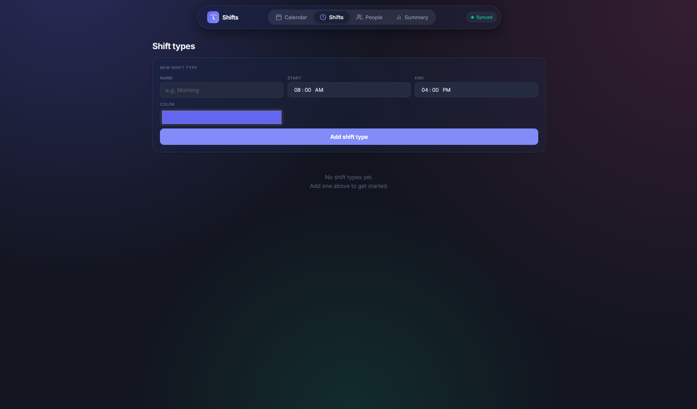
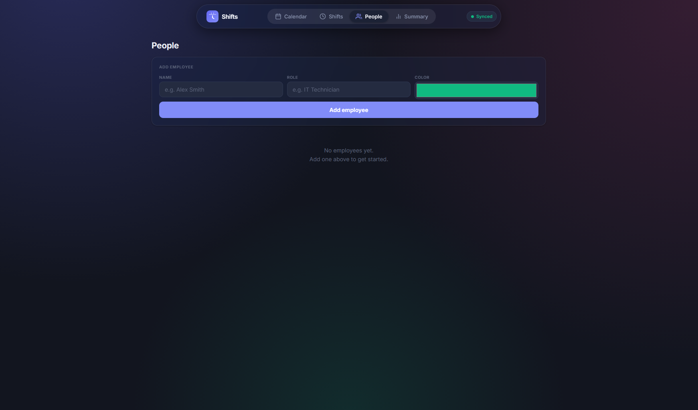
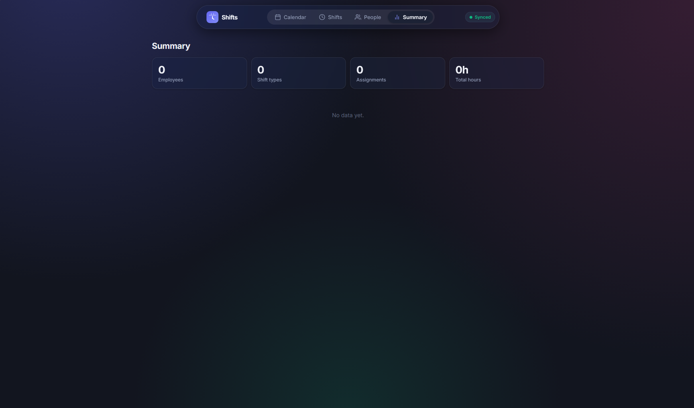
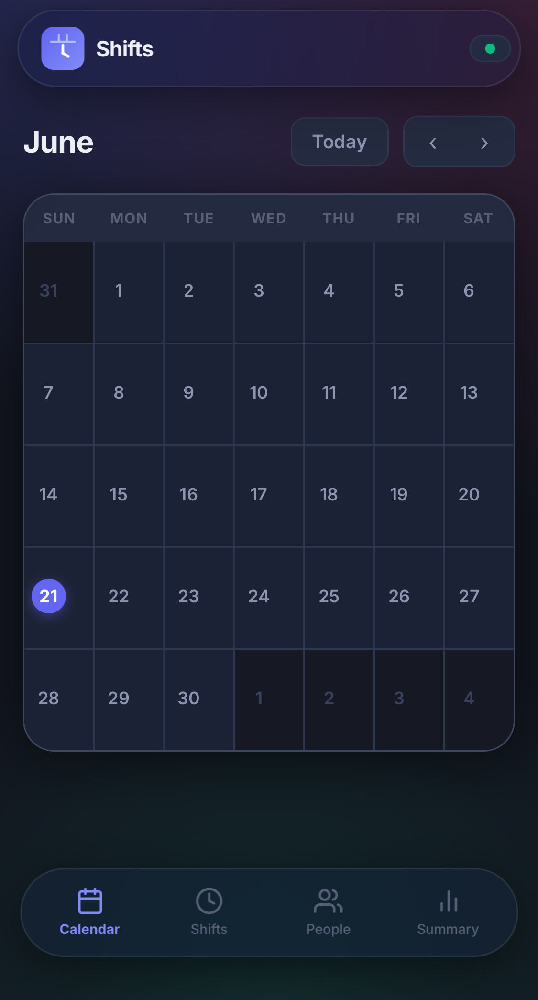
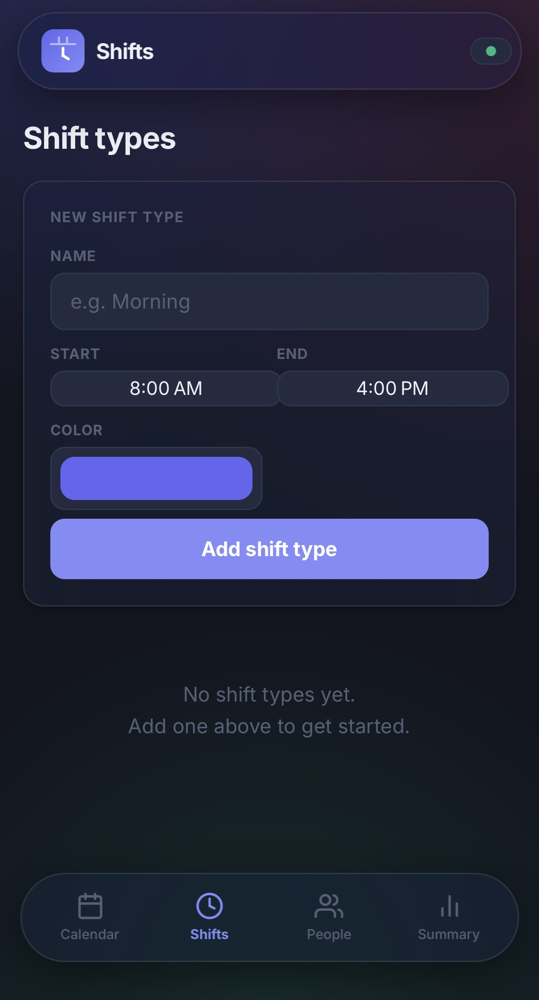
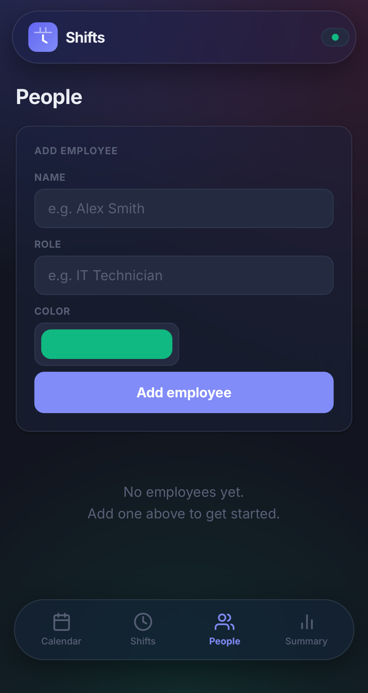
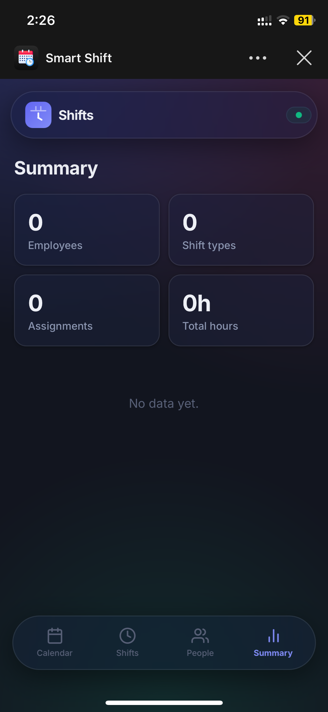

## About

Smart Shift is a minimal self hosted docker app for zimaos and casaos

It can track your and others work flow

Smart Shift will automatically sync your data to all of your devices

## How to install

1. make folders and move the files there

   /DATA/AppData/smart-shift/ ← public/, server.js, package.json, package-lock.json

   /DATA/AppData/smart-shift/ ← data/

3. use the [Smart Shift compose.yaml] on App Store → "Install a Customized App" → Docker Compose tab

4. w8

5. enjoy

# Shadow out

## Screenshots

Pc

  
   
   
   
 

Phone

  
   
   
   

